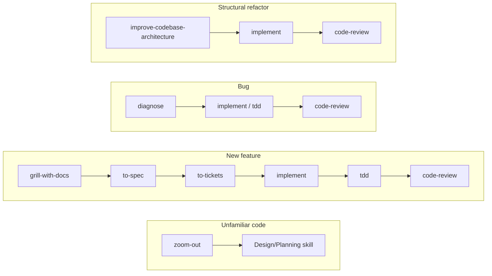

# agent-workflow

Reusable AI-agent workflows for software engineering: **18 prompt-driven
skills** and one autonomous agent, [`issue-killer`](agent/issue-killer/AGENT.md).

Skills describe a process that an AI session follows. Agents are executable
supervisors that launch worker processes and can perform repository or tracker
mutations. They are intentionally documented separately.

## Install

The installer replaces its managed cache with a fresh clone and reconciles the
selected destinations on every run. Links owned by this repository are removed
before the current skills and agents are installed, so renamed or deleted
artifacts do not survive an update. Files and links owned by other tools are
left untouched. The recommended command installs every supported global
integration for the current user:

```bash
# Claude Code, shared agent clients, and command-line runners
curl -fsSL https://raw.githubusercontent.com/elvisbrevi/agent-workflow/main/install.sh \
  | bash -s -- --all-global
```

Use a narrower mode only when a client or project must be isolated:

```bash
# Claude Code only, all projects
./install.sh --claude-global

# Shared skills/agents, all projects
./install.sh --global

# Shared skills/agents, one project
./install.sh --local --target ~/my-project

# OpenCode, one project
./install.sh --opencode --target ~/my-project
```

Other useful options are `--claude-local`, `--both`, `--dry-run`,
`--uninstall`, `--force`, and `--ref <branch-or-tag>`. Run `./install.sh
--help` for the complete list. Without a mode, the installer opens an
interactive menu and requires a controlling TTY.

## Skills

Skills are stored as `SKILL.md` files and do not execute shell commands by
themselves. Invoke them explicitly using the client syntax (`/skill-name` in
Claude Code or `$skill-name` in Codex), or let the client select them when its
trigger matches the request.

| Phase | Skills | Use when |
|---|---|---|
| Discovery | `zoom-out` | The code or problem is unfamiliar |
| Design | `domain-modeling`, `grill-with-docs`, `prototype`, `improve-codebase-architecture` | Terms, decisions, prototypes, or structure need work |
| Planning | `wayfinder`, `to-spec`, `to-tickets`, `triage` | Work must be mapped, specified, decomposed, or classified |
| Implementation | `implement`, `tdd` | A ticket/spec is ready to build and test |
| Diagnosis | `diagnose` | A defect needs reproduction and a regression test |
| Review | `code-review`, `handoff` | Changes need independent review or session transfer |
| Utility | `caveman`, `grilling`, `setup-elvis-brevi-skills`, `write-a-skill` | Communication, interviewing, setup, or new skill authoring |

Typical paths:



Skills with `disable-model-invocation: true` are explicit-only. See each
`SKILL.md` for its exact trigger and output contract.

## Autonomous agents

| Agent | Purpose | Source |
|---|---|---|
| `issue-killer` | Drains eligible issues one at a time with isolated workers | [`agent/issue-killer/`](agent/issue-killer/) |

More agents can be added under `agent/<name>/`; each must have its own
contract, executable entrypoint, state namespace, tests, and README entry.

## issue-killer

`issue-killer` is a destructive, CLI-neutral supervisor. For each iteration it:

1. Detects and validates the repository tracker (`gh` for GitHub; `az boards`
   and `az repos` for Azure DevOps).
2. Selects one open, ready, non-epic, unblocked issue.
3. Starts a fresh worker CLI process using the selected execution profile.
4. Requires the worker to implement, test, review, push, create and merge a PR,
   and close the issue.
5. Starts the next worker only after the previous one emits
   `ISSUE_COMPLETED`; otherwise it stops safely.

The worker contract requires these skills:

- `/implement` for the change;
- `/tdd` where a suitable test seam exists;
- `/code-review` before completion.

The loop stops on an empty queue, blocked work, failed or malformed worker
output, ambiguous recovery, dirty state, or exhausted retries. It uses a shared
Git-common-directory lock and checkpoint so linked worktrees cannot run two
supervisors concurrently.

### Configure a profile

Create `~/.config/issue-killer/config.toml`. The file contains no credentials;
each CLI must already be installed and authenticated independently.

```toml
default_profile = "claude-main"

[profiles.claude-main]
label = "Claude main"
cli = "claude"
command = "claude"          # executable or shell function
model = "your-claude-model"

[profiles.claude-main.options]
permission_mode = "bypassPermissions"

[profiles.codex-main]
label = "Codex main"
cli = "codex"
command = "codex"
model = "your-codex-model"

[profiles.codex-main.options]
reasoning_effort = "high"
sandbox = "danger-full-access"

[profiles.opencode-main]
label = "OpenCode main"
cli = "opencode"
command = "opencode"
model = "provider/your-model"
fallbacks = ["opencode-backup"]

[profiles.opencode-main.options]
variant = "high"
auto_approve = true

[profiles.opencode-backup]
label = "OpenCode backup"
cli = "opencode"
command = "opencode"
model = "provider/backup-model"
```

`default_profile` is used for non-interactive launches. With a TTY, the agent
shows the configured profiles and asks the operator to select one; OpenCode
also offers an ordered fallback chain. Fallbacks are OpenCode-only and are
used only for approved provider availability/rate-limit failures, not for
implementation failures.

If `command` is a shell function, add `shell = "bash"` and
`init_file = "~/.bashrc"` (or the appropriate initialization file). Profile
commands and option values are strictly validated; arbitrary shell expressions
and `eval` are not supported.

### Use it

From the target Git repository:

```bash
issue-killer

# Explicit configuration and repository
issue-killer --config ~/.config/issue-killer/config.toml /path/to/repository

# Local Claude Code installation
./.claude/bin/issue-killer
```

The command accepts `[--config <path>] [repository]`. Defaults are:

| Variable | Default | Purpose |
|---|---:|---|
| `ISSUE_RUNNER_BASE_BRANCH` | `main` | PR target and integration branch |
| `ISSUE_RUNNER_MAX_ITERATIONS` | `0` | Completed issues limit; `0` means unlimited |
| `ISSUE_RUNNER_PROGRESS_INTERVAL` | `30` | Heartbeat seconds; `0` disables it |
| `ISSUE_RUNNER_ASSUME_YES` | `false` | Skip destructive confirmation; use only with explicit authorization |
| `ISSUE_RUNNER_STREAM_OUTPUT` | `true` | Render structured provider progress |
| `ISSUE_RUNNER_RETRY_DELAYS` | `15,30,60` | Backoff for transient worker transport failures |
| `ISSUE_RUNNER_RETRY_LIMIT` | derived | Maximum attempts per issue, including the first |
| `ISSUE_RUNNER_TRANSIENT_PATTERNS` | built-in | Newline-separated regex overrides for transient failures |
| `ISSUE_RUNNER_ADOPT_ISSUE` | unset | Explicit issue number required to adopt dirty legacy work |

For live status and checkpoint inspection:

```bash
cat "$(git rev-parse --git-common-dir)/issue-killer.lock/status"
cat "$(git rev-parse --git-common-dir)/issue-killer.checkpoint"
```

The default structured stream can contain sensitive provider event data; do not
publish raw output or checkpoint files. Set `ISSUE_RUNNER_STREAM_OUTPUT=false`
for legacy plain output. `jq` is required for the default stream mode.

### Safety boundary

Before normal execution the supervisor validates the tracker, profile,
authentication prerequisites, base branch, and clean worktree, then requests
confirmation for the destructive loop. It never guesses a recovery issue from
a branch or file name. A missing status marker or partial PR/issue result stops
the loop with `RECOVERY_REQUIRED`.

Details about recovery, adapters, checkpoint fields, migration, and exit
statuses are in [`agent/issue-killer/REFERENCE.md`](agent/issue-killer/REFERENCE.md).
The worker instructions are in [`PROMPT.md`](agent/issue-killer/PROMPT.md).

## Repository documentation

- [`AGENTS.md`](AGENTS.md): where to modify code, invariants, and validation.
- [`CONTEXT.md`](CONTEXT.md): domain vocabulary.
- [`docs/agents/issue-tracker.md`](docs/agents/issue-tracker.md): tracker contract.
- [`docs/agents/triage-labels.md`](docs/agents/triage-labels.md): canonical roles.
- [`docs/design/issue-killer.md`](docs/design/issue-killer.md): design and adapter boundaries.

## Tests

```bash
bash tests/install_test.sh
bash tests/issue_killer_test.sh
bash tests/issue_killer_migration_test.sh
bash tests/github_tracker_adapter_test.sh
bash tests/azure_devops_tracker_adapter_test.sh
```

The runner is expected to remain compatible with Bash 3.2 and a current Bash
release. Do not use real credentials or a real backlog in the test suites.
