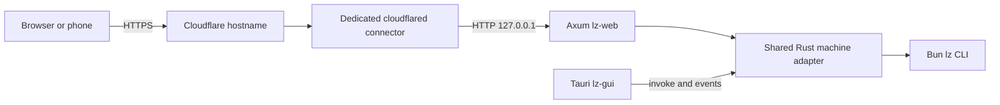

# Self-hosted web access

The same React interface runs in Tauri and in a browser, including a phone.
`lz-web` serves the built interface and an authenticated API from one origin.
Each owner installs it on their own server, under their own OS account, with
their own repositories, configuration and CLI credentials. There is one owner
per installation; this is not a multi-tenant service.

The first owner's dedicated hostname, `agent-workflow.elvisbrevi.cl`, has its
Cloudflare DNS/tunnel prepared. Its selected login is Cloudflare Access with
GitHub; [ACCESS.md](ACCESS.md) describes configuration and local identity binding.
Its Mac installation and activation steps are
in [the deployment handoff](DEPLOYMENT-elvisbrevi.cl.md).



The desktop and web processes share the adapter's code. An OS file lock prevents
both from opening the same `gui.json` profile simultaneously. Stop the backend
before opening that profile in Tauri, and close Tauri before restarting it.
Separate web installations also have an installation lock. A process restart
never resumes or replays a workflow automatically.

On Linux/macOS an active CLI inherits the profile lease. If the parent crashes,
an orphaned CLI keeps a new instance from opening that profile until it exits.
Inspect the owner's processes and reconcile the existing run rather than
removing the lock file; deleting it would defeat the lease. Systemd additionally
manages descendants in the service's control group.

## Existing boundaries and web adaptations

Workflow logic, parsing, validation, checkpoints, credentials and the CLI run
log stay in `agent/lazy-workflow/src/`. Rust loads `lz catalog`, shapes the local
environment, starts/cancels child processes and reads the log. `core.rs` and
`runner.rs` have no Tauri dependency; `desktop.rs` adapts them to Tauri and
`web/` adapts them to HTTP. The `gui.json` schema remains version 1.

| Existing surface | Desktop | Browser |
|---|---|---|
| `get_settings`, `save_settings` | Full local settings | Redacted settings; only theme, confirmation, active registered repository and form defaults are writable |
| `load_catalog`, `start_run`, `cancel_run` | CLI catalog and runs through `invoke` | Server allowlist narrows that catalog and validates arguments before the same runner |
| `read_run_log`, `diagnose`, `reload_environment` | Local log and environment | Same installation's fixed log; diagnostics report variable presence, never values |
| `capture_lz` | Local helper for credentials and other CLI probes | Not exposed over HTTP |
| `lz://run-output`, `lz://run-exit` | Tauri event bus | Authenticated polling, plus run-start receipts for reconnection |
| Files and directories | Native dialog on the desktop device | Registered **server** repositories; text uploaded from the **browser device** is stored under generated server filenames |
| Dialogs, windows and links | Tauri dialog/opener plugins, existing window | Browser confirmation, responsive page and HTTP(S) links |
| Reveal a file | Native opener | Hidden: a phone cannot reveal a server file in its own file manager |
| Notifications | No notification plugin in the existing app | Status and output remain in the page |
| Provider authentication | Existing CLI/credential store on the local machine | Configure providers locally on the server; there is no browser credential-management endpoint |
| Planning HTTP interview | Existing private local URL | Per-run bearer registers the private loopback URL; the logged-in owner answers through fixed authorized web endpoints |

The browser uses an expiring local session, authenticated either by the explicit
password mode or verified Cloudflare Access. It never receives a Cloudflare administration
token, connector token or the private interview-registration bearer. The
existing interview server remains private. There is no generic HTTP proxy,
client-selected profile or server-selected-by-the-client endpoint.

## Build and configure on the owner's machine

Use a checkout containing this feature. Install Bun, Rust 1.90 or newer, Git and
the provider tools the owner uses (`gh`, `az`, `codex`, `claude`, `opencode`, etc.).
The headless build needs a C toolchain but no GTK, WebKit or Tauri system
libraries. Install `cloudflared` through its
[official packages](https://developers.cloudflare.com/cloudflare-one/connections/connect-networks/downloads/)
(on macOS, `brew install cloudflared`). Use a version supporting `--token-file`.
All commands below run as the owner, on the machine that will keep running Rust
and the CLI. The example below retains password authentication for existing
independent installations. For the selected `elvisbrevi.cl` deployment, provision
Access and replace `--owner owner` with `--access-config "$LZ_WEB_DATA_DIR/access.json"`
as in [ACCESS.md](ACCESS.md). Replace the example values before initialization.

```bash
LZ_PROJECT_DIR="$HOME/src/agent-workflow"
LZ_WEB_DATA_DIR="$HOME/.local/share/lz-web"
LZ_SERVER_REPOSITORY="$HOME/src/my-project"
LZ_PUBLIC_URL="https://lz.example.com"

cd "$LZ_PROJECT_DIR/agent/lazy-workflow"
bun install --frozen-lockfile
cd gui
bun install --frozen-lockfile
bun run typecheck
bun run build:web
cd src-tauri
cargo build --locked --release --no-default-features --features web --bin lz-web

./target/release/lz-web init \
  --data-dir "$LZ_WEB_DATA_DIR" \
  --public-url "$LZ_PUBLIC_URL" \
  --settings "$LZ_WEB_DATA_DIR/gui.json" \
  --frontend "$LZ_PROJECT_DIR/agent/lazy-workflow/gui/dist" \
  --owner owner
```

`init` prompts for a password without echoing it. It requires 12–1024 bytes,
hashes it with Argon2id, preserves an existing installation, and creates private
state outside every Git checkout. `--password-stdin` is available for a secrets
manager; never put a password in command arguments. To use an existing desktop
profile instead, pass its absolute `gui.json` path to `--settings`; initialization
does not replace it.

Configure the CLI launcher and repositories locally using the existing helper:

```bash
cd "$LZ_PROJECT_DIR/utility/lz"
LAZY_WORKFLOW_GUI_SETTINGS="$LZ_WEB_DATA_DIR/gui.json" \
  bun scripts/gui-settings.ts set lzCommand "$LZ_PROJECT_DIR/agent/lazy-workflow/main.ts"
LAZY_WORKFLOW_GUI_SETTINGS="$LZ_WEB_DATA_DIR/gui.json" \
  bun scripts/gui-settings.ts add repositories "$LZ_SERVER_REPOSITORY"
LAZY_WORKFLOW_GUI_SETTINGS="$LZ_WEB_DATA_DIR/gui.json" \
  bun scripts/gui-settings.ts set activeRepository "$LZ_SERVER_REPOSITORY"
LAZY_WORKFLOW_GUI_SETTINGS="$LZ_WEB_DATA_DIR/gui.json" \
  bun scripts/gui-settings.ts set commandDefaults.plan.--interview http
```

Install/authenticate the coding-agent and tracker tools for this OS account.
Store provider secrets with `lz credentials-set` and list their names in
`secretEnvironment`, following [the settings reference](../../../utility/lz/GUI.md).
Credentials remain in the CLI's existing account-specific store. Keep secrets
out of `gui.json` and out of the repository. The launcher above uses the checked
out CLI; keep that checkout available and update CLI and GUI together.

`web.json` selects the public HTTPS origin, `127.0.0.1:8234`, absolute settings
and frontend paths, a 12-hour absolute session expiry, `maxRuns: 1`, and an
explicit initial list of workflow, Git and GitHub/PR operations. The actual
installed CLI catalog must contain every listed operation. An owner can edit
`allowedCommands`, `sessionSeconds` (60–2592000) and `maxRuns` (1–16) locally
while the service is stopped. Credential commands, `gui`, `update`, raw stdin,
forwarded flags, shutdown, custom log paths and interview bind options are
always excluded from web execution. The API requires long flags as separate
arguments; it rejects aliases, unknown flags and unregistered paths.

To check the backend before installing services, run in one terminal:

```bash
"$LZ_PROJECT_DIR/agent/lazy-workflow/gui/src-tauri/target/release/lz-web" \
  serve --data-dir "$LZ_WEB_DATA_DIR"
```

In another, `curl --fail http://127.0.0.1:8234/health` should return
`{"status":"ok"}`. Stop it with Ctrl-C before installing/starting the service.
The browser login requires the configured HTTPS origin; opening this loopback
HTTP URL is not a public-web test. Do not add a Cloudflare Host override.

## Dedicated Cloudflare tunnel and DNS

Supply `CLOUDFLARE_ACCOUNT_ID` and `CLOUDFLARE_API_TOKEN` through the machine's
configured secret environment. The administration token needs **Zone Read**
and **DNS Edit** on the chosen zone, and **Cloudflare Tunnel Edit** on the chosen
account. It is used only for provisioning, not installed into either service.
The token fetched for `cloudflared` is a different, tunnel-specific connector
credential, written to `connector.token` with mode 0600.

```bash
cd "$LZ_PROJECT_DIR/agent/lazy-workflow/gui"
bun scripts/provision-tunnel.ts --data-dir "$LZ_WEB_DATA_DIR"
bun scripts/provision-tunnel.ts --data-dir "$LZ_WEB_DATA_DIR" --apply
```

The first command is a read-only plan. The second creates a remotely managed
tunnel named `lz-web-<hostname>`, writes ownership metadata in `cloudflare.json`,
configures hostname → `http://127.0.0.1:8234` followed by a catch-all 404, and
creates a **proxied CNAME** from the subdomain to `<UUID>.cfargotunnel.com`.
It preserves the public Host. Compatible resources recorded as belonging to
this installation are reused. Foreign DNS, ambiguous names, other routes and
Host overrides cause an error without being overwritten. To adopt a compatible
existing tunnel belonging to this project, supply `--reuse-tunnel-id <UUID>`;
a matching name alone is insufficient evidence of ownership.

Provisioning can finish before a connector is running. If it fails after
creating a resource, retain `cloudflare.json` and retry; it records the owned
UUID so the script does not create another tunnel.

## Persistent services

The installer copies the backend and built assets into the private data
directory, then writes two user services: Rust backend and `cloudflared`.
It scopes their names to the data directory and preserves unrelated services
and manually modified units. It does not embed secrets in a unit or plist.

```bash
cd "$LZ_PROJECT_DIR/agent/lazy-workflow/gui"
bun scripts/install-web-services.ts \
  --data-dir "$LZ_WEB_DATA_DIR" \
  --backend "$PWD/src-tauri/target/release/lz-web" \
  --frontend "$PWD/dist" \
  --cloudflared "$(command -v cloudflared)"

bun scripts/install-web-services.ts \
  --data-dir "$LZ_WEB_DATA_DIR" \
  --backend "$PWD/src-tauri/target/release/lz-web" \
  --frontend "$PWD/dist" \
  --cloudflared "$(command -v cloudflared)" \
  --install --start
```

The first command only prints the plan. Linux uses `~/.config/systemd/user/`
units, `Restart=on-failure`, a five-second retry, SIGTERM and a 15-second stop
timeout; logs go to the user's journal. Enable lingering for that OS account
(`loginctl enable-linger <account>`, with administrator privileges if required)
if it must start at boot and survive logout. macOS uses `~/Library/LaunchAgents/`,
starts at login, restarts after failure and writes logs to the private `logs/`
directory. `service.json` records the exact unit paths and labels.

On Linux, inspect/restart/stop each recorded label with `systemctl --user
status|restart|stop <label>` and read logs with `journalctl --user -u <label>`.
On macOS use `launchctl print gui/$(id -u)/<label>`, `launchctl kickstart -k
gui/$(id -u)/<label>` and `launchctl bootout gui/$(id -u)/<label>`; use
`launchctl bootstrap gui/$(id -u) <plist>` to load it again. The service installer
stops its own previous services before updating artifacts; repeat it with
`--frontend "$PWD/dist" --install --start` after rebuilding.

Rust continues running on this machine. A sleeping or logged-out Mac with
LaunchAgents is not an always-on server. For independence from the Mac, put the
backend, CLI, repositories, credentials and connector on a permanent Linux
server. Do not run two owners under the same OS identity and call their
directory layout OS isolation: workflow subprocesses and coding agents have
that account's permissions. Use separate servers, containers or OS accounts
for that boundary. Path checks here restrict HTTP arguments, not the operating
system authority of an authorized workflow.

## Sessions, files and recovery

The API uses a random session cookie (`Secure`, `HttpOnly`, `SameSite=Strict`,
`__Host-` prefix); only its SHA-256 digest is stored. Sessions survive backend
restarts until their absolute expiry. JSON mutations require the exact public
Origin, an accepted Host, `X-LZ-Web: 1` and the session's CSRF token. Login also
requires same-origin JSON. Limits are per installation: five login attempts and
600 requests per minute, 2 MiB HTTP bodies, 32 active sessions, and configured
simultaneous runs. The page sends no administration bearer.

Stop the backend before local password changes or revocation:

```bash
"$LZ_WEB_DATA_DIR/bin/lz-web" set-password --data-dir "$LZ_WEB_DATA_DIR"
"$LZ_WEB_DATA_DIR/bin/lz-web" revoke-sessions --data-dir "$LZ_WEB_DATA_DIR"
```

Either action revokes all sessions; then restart the backend. Logout revokes
the current session immediately. Data/state directories use mode 0700 and
credential/state files 0600. Back up the private directory and the owner's
existing CLI credential store using their normal protected backup process.

A browser upload accepts UTF-8 text up to 1 MiB and creates a random filename
under `uploads/`; it cannot choose an output path. Up to 100 uploads are kept.
Remove unused files locally while no run needs them. Registered server files
are canonicalized to reject symlinks escaping the approved repositories.

`start_run` uses a browser-generated request ID. The server persists the intent
before spawning and its acknowledgement before returning. The same ID does not
spawn again, including after restart. An uncertain start returns a conflict
requiring inspection of history. Receipts are bounded to 1024 and seven days;
the CLI's normal run log remains the durable workflow record. The live feed is
bounded to 3000 events/2 MiB, not a complete archive. Shutdown interrupts active
process groups, waits, then force-stops them; recover interrupted checkpoints
through the existing CLI procedure rather than automatically rerunning jobs.

## Verification and publication status

Use synthetic repositories and provider stubs when testing. The automated
browser fixture uses a short-lived, self-signed certificate on loopback and
does **not** start a Cloudflare connector. It needs OpenSSL, an available
loopback port 443 (or the OS capability to bind it), and Playwright Chromium:

```bash
cd "$LZ_PROJECT_DIR/agent/lazy-workflow/gui"
bun run build:web
(cd src-tauri && cargo build --locked --no-default-features --features web --bin lz-web)
bun x playwright install chromium
bun run test:web
```

It exercises login/logout/expiry, secure cookies, the shared forms, private
interview answers, browser text upload, local-only settings, persistence after
a real backend restart and desktop/phone viewport overflow. Additional browser
scenarios simulate the Access gateway to verify automatic SSO exchange, no
password fallback and top-level sign-in/logout navigation. Rust tests cover
real synthetic RSA signatures, JWKS rotation/failures, issuer/audience/time,
pinned GitHub identity, local binding, migration and persistent logout replay
protection, as well as
authorization, two independent installations, callback authentication, paths,
idempotency and duplicate-process prevention. See [the recorded checks](WEB-VERIFICATION.md).

For **a real deployment**, independently record these four states:

1. Code built and installed on the target machine.
2. Project DNS CNAME and tunnel ingress configured in the correct zone/account.
3. Connector connected and backend healthy, confirmed through service logs/status.
4. App verified at its real HTTPS hostname from a phone: certificate, login,
   an allowed synthetic operation, logout/expiry, interview callbacks where used,
   and persistence after restarting both services. Confirm a second owner's
   installation rejects the first owner's cookie and has its own configuration.

Code and local HTTPS checks do not establish states 2–4. A concrete hostname,
Cloudflare resource permissions and execution access to the chosen persistent
machine are required to finish publication.
